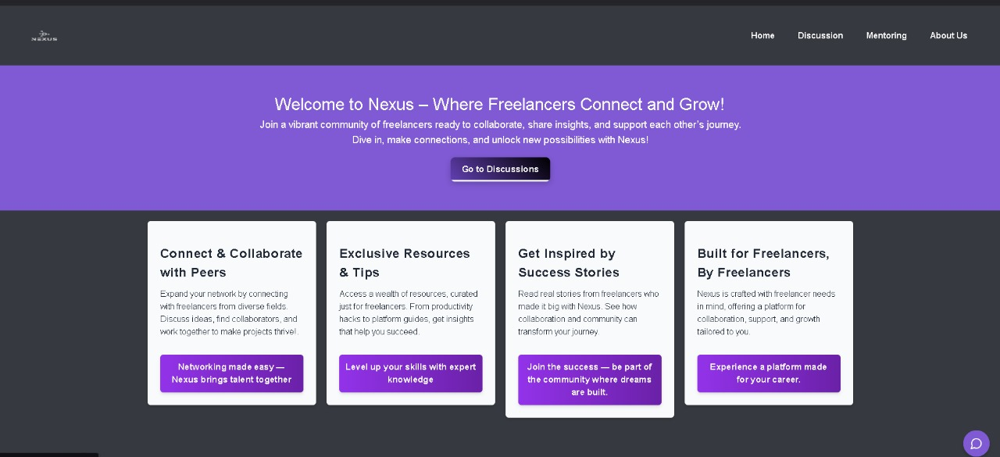
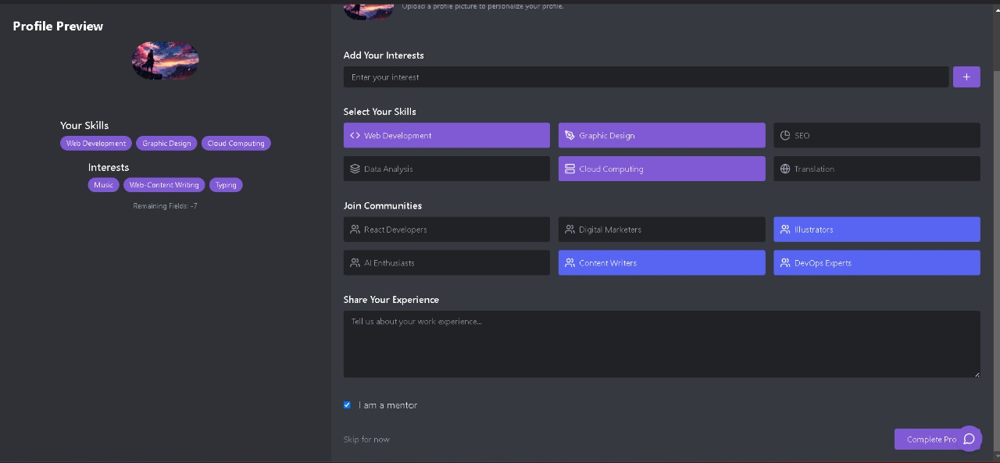
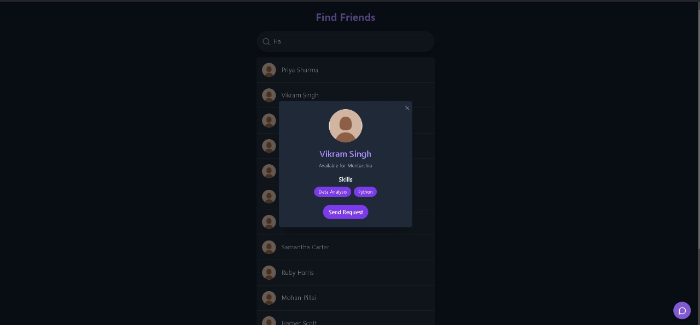
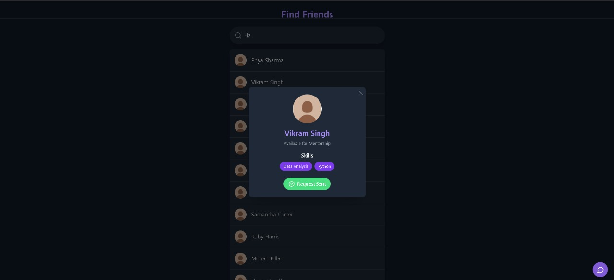

```
# Nexus by ClutchCoders

**Nexus** is a modern **community forum** designed for freelancers to connect, collaborate, and communicate seamlessly. Built with a robust stack including **React**, **TypeScript**, **Node.js**, **Socket.IO**, and **MongoDB**, Nexus enables real-time discussions, private messaging, and an intuitive user interface. The platform supports real-time updates, ensuring users stay connected and engaged in meaningful conversations.

---

## **Key Features**
1. **Community Forum**: Centralized space for freelancers to discuss topics, share knowledge, and network.
2. **Private Messaging**: Secure, real-time communication between users.
3. **User Profiles**: Rich user profiles showcasing freelancer skills and experiences.
4. **Real-Time Updates**: Powered by **Socket.IO**, ensuring seamless communication.
5. **Scalable Backend**: Built with **Node.js**, **MongoDB**, and **Express** for robust performance.
6. **Responsive UI**: Designed with **React** and **Vite** for fast and efficient user experiences.

---

## **Tech Stack**
- **Frontend**: React, TypeScript, Vite
- **Backend**: Node.js, Express, Socket.IO
- **Database**: MongoDB (Cloud-based via Atlas)
- **State Management**: Context API or Redux (as needed)
- **Styling**: TailwindCSS
- **Package Manager**: Yarn

---

### 1. **Login Page**


Got it! Here’s the user-friendly description to add to the **README** file for the **Login Page**:

---

### **Login Page**

The **Login Page** offers a simple and secure way for users to access their Nexus accounts. We’ve integrated **Google Login** for an easy and seamless sign-in experience. Here's why this method is the best for you:

- **Easy Access**: With just one click, users can log in using their Google account, avoiding the need to remember multiple passwords.
- **Security First**: Google Login uses industry-standard encryption and two-factor authentication, ensuring your account is safe from unauthorized access.
- **User-Friendly**: No long forms to fill out! A fast and efficient way to get started with Nexus.

#### **How It Works:**
1. Click on the **“Login with Google”** button.
2. You’ll be redirected to a secure Google login page.
3. After logging in, you’ll be taken to your Nexus dashboard where you can explore all the platform’s features.

**Note**: The login process ensures that your data is kept secure and only necessary information, such as your email, is shared.

---

### 2. **Landing Page**


**Description**:  
Welcome to Nexus – Your Freelancer Hub!

1.What Makes the Landing Page Special?
Warm Welcome: A friendly introduction to the Nexus community, inviting freelancers to join and explore.
2.Clear Purpose: Highlights how Nexus connects freelancers and helps them collaborate effectively.
3.Easy Navigation: Simple buttons like "Get Started" and "Learn More" to guide new visitors effortlessly.
4.Quick Overview: A sneak peek into the platform’s features like forums, messaging, and profiles.
5.Inspiring Stories: Real testimonials from freelancers who’ve benefited from the platform.
6.Vibrant Visuals: Bright and engaging images that showcase a thriving, inclusive community.
7.Always Accessible: Works beautifully on any device – mobile, tablet, or desktop!
8.Get in Touch: Easy-to-find contact info and social links so users can stay connected.


---
---

### 2. **Home Page**


**Description**:  
###3. **Home Page**  
  

**Discover, Connect, and Thrive!**  

#### **What Makes the Home Page Stand Out?**  
1. **Central Hub**: Serves as the starting point for users to explore all key features of Nexus.  
2. **Easy Navigation**: Clearly organized tabs guide users to essential sections like **Discussion**, **Resources**, and more.  
3. **"Connect & Collaborate"**: Direct access to the Discussion tab for real-time chats and community-building.  
4. **Resource Library**: A curated section with tools, guides, and inspiration for freelancers.  
5. **By Freelancers, For Freelancers**: Highlights Nexus’s unique focus on empowering freelancers through collaboration.  
6. **Dynamic Updates**: Quick glimpses of active discussions, trending topics, and recent posts.  
7. **Call to Action**: Prominent buttons and links encourage users to dive into features like starting a discussion or exploring profiles.  
8. **Mobile-Friendly**: Optimized for seamless browsing on any device.  

The home page ensures users can navigate effortlessly while showcasing the platform's value as a freelancer-first community.
---

### 4. **Profile Page**


**Description**:  
### **Profile Page**  
  

**Showcase, Earn, and Grow!**  

#### **Why the Profile Page is Your Personal Hub**  
1. **Skill Showcase**: Highlight your unique skill set to attract collaborators and clients.  
2. **Achievements Display**: Share your milestones and accomplishments to inspire others.  
3. **Mentorship Stats**: Track your journey as a mentor or mentee, including sessions conducted and feedback received.  
4. **Earn SuperCoins**: Gain rewards for active participation and contributions to the community.  
5. **Redeem Options**: Use SuperCoins to unlock exclusive resources, services, or platform perks.  
6. **Badges for Recognition**:  
   - **Mentor Badge**: Celebrate your efforts in guiding others.  
   - **Freelancer Badge**: Showcase your dedication as an active community member.  
7. **Interactive Design**: Intuitive and user-friendly layout for easy updates and profile customization.  
8. **Growth-Oriented**: Encourages users to engage more and gain recognition within the community.  

The profile page transforms into a personal brand builder while rewarding your efforts and contributions to Nexus!  
---

### 5. **Chat Bot**


**Description**:  
### **Chatbot**  
  

**Your Personalized Assistant**  

#### **Why the Chatbot is Your Go-To Helper**  
1. **Personalized Assistance**: Tailored to address your queries about the platform and its features.  
2. **24/7 Availability**: Always ready to help, no matter the time or location.  
3. **Quick Navigation**: Guides users to the relevant sections of the website with ease.  
4. **Freelancer-Focused Help**: Offers tips, resources, and advice to maximize the benefits of the community.  
5. **Simplifies Complex Tasks**: Breaks down intricate processes, like profile optimization or skill showcasing, into manageable steps.  
6. **Resourceful**: Equipped to share important links, FAQs, and updates in real time.  
7. **Friendly and Human-Like**: Ensures users feel welcomed and supported throughout their journey.  

The chatbot ensures every user feels empowered to navigate and utilize Nexus seamlessly!  
---

### 6. **Mentorship Section**


**Description**:  
### **Mentorship**  
  

### **⚠ Alert: Prototype Notice**  
*The users displayed in the mentorship section are **dummy users** for demonstration purposes only. In future updates, we will integrate real user profiles to enhance the experience.*  

---

  
  

**Empowering Connections Through Mentorship**  

#### **Key Highlights of the Mentorship Feature**  
1. **Find Your Mentor**: Search for experienced professionals who can guide you in your freelancing journey.  
2. **Find Your Friend**: Discover and connect with like-minded freelancers to collaborate and grow together.  
3. **Advanced Search Mechanism**: Quickly filter mentors and friends based on skills, experience, or interests.  
4. **Connection Requests**: Send personalized requests to mentors or peers to initiate meaningful conversations.  
5. **Build Your Network**: Expand your circle with valuable professional connections to enhance your freelancing experience.  
6. **Skill-Based Pairing**: Match with mentors and friends who align with your goals and aspirations.  
7. **Supportive Community**: Foster relationships that help you achieve your milestones.  

The mentorship feature makes Nexus more than just a platform—it’s your gateway to a collaborative and supportive freelancing community!  
---
Here’s the user-friendly description to add to the **README** file for the **Find Friends** feature:

---

### **Find Friends**

 




The **Find Friends** feature helps users discover and connect with like-minded freelancers on the Nexus platform. Whether you're looking to collaborate on a project or just expand your professional network, this feature is designed to make the process easy and efficient.

- **Search Mechanism**: Users can search for friends based on specific criteria like skills, location, or interests. This helps you find people with the right expertise to connect with.
- **Send Connection Requests**: Once you find someone you’d like to connect with, simply send them a request. They’ll receive a notification, and if they accept, you’re connected and can start collaborating.
- **Expand Your Network**: The feature encourages freelancers to build meaningful relationships and foster collaboration, whether you're seeking help on a project or offering your mentorship.

#### **How It Works:**
1. **Search**: Use the search bar to find freelancers by name, skill, or other parameters.
2. **Send Request**: After finding a potential friend, click on the **“Send Request”** button to send a connection invitation.
3. **Wait for Acceptance**: Once your request is accepted, you’ll be able to communicate and collaborate with them via the platform.

This feature helps expand your professional circle and enhances the sense of community on Nexus!

### 6. Discussion Page**


**Description**:  
  

**Engage, Interact, and Collaborate in Real Time**  

#### **Key Features of the Discussion Forum**  

1. **Real-Time Communication**: Users can engage in live conversations, ensuring instant responses and dynamic discussions.  
2. **Interactive Threads**: Start, join, or contribute to discussion threads on a variety of topics relevant to freelancers.  
3. **Connect with the Community**: Build meaningful connections by participating in discussions with peers, mentors, and industry professionals.  
4. **Secure Messaging**: Your messages are encrypted to ensure safe and secure communication.  
5. **Collaborative Space**: Share insights, ask questions, and brainstorm ideas with the freelancing community.  
6. **Categorized Topics**: Discussions are organized into categories, making it easier for users to find and participate in topics of interest.  
7. **Notifications**: Get real-time alerts for responses to your posts or threads you’re following.  

The **Discussion Forum** fosters an inclusive and collaborative environment, empowering users to learn from each other, seek advice, and grow together as a community.
---

### 7. **Notifications**


**Description**:  
### **Notifications Page**  

**Stay Updated with Real-Time Alerts**  

#### **Key Features of the Notifications**  

1. **Real-Time Alerts**: Get instant notifications for messages, comments, replies, and mentions in the Discussion Forum and other parts of the platform.  
2. **Customizable Preferences**: Tailor your notification settings to receive alerts for activities that matter most to you, like new messages or mentor requests.  
3. **Mentor & Mentee Updates**: Receive notifications when a mentor responds to your query or when a mentee sends you a request.  
4. **Discussion Follow-ups**: Stay on top of ongoing discussions by getting notified whenever there’s a new reply or important update.  
5. **New Opportunities**: Get notified about relevant job postings, networking opportunities, and events in the freelancing world.  
6. **Unread Messages & Requests**: Easily manage your unread messages and pending requests from mentors or collaborators, ensuring you never miss an opportunity.  
7. **Activity Summary**: View a summary of your latest activities, including engagement in discussions, chats, and profile updates.  

Notifications are designed to keep you connected and up to date, ensuring that you never miss important interactions within the Nexus community. Stay informed and responsive to opportunities as they arise!

---

### **About Us**  
  

**Nexus: Empowering Freelancers, Building Connections**  

At **Nexus**, our mission is simple – **to create a thriving, supportive community for freelancers** to connect, collaborate, and grow together. Whether you're a seasoned freelancer or just starting out, Nexus is the place where you can network, gain insights, find mentors, and explore exciting opportunities.

#### **Who We Are**  

We are a group of passionate developers, designers, and entrepreneurs committed to making freelancing a rewarding career choice. We believe in the power of community and collaboration, which is why we’ve built Nexus to be a space that brings freelancers together.  

#### **Our Vision**  

To be the go-to platform for freelancers looking for **professional growth**, **mentorship**, and **collaborative opportunities**, where they can thrive in a supportive environment. We envision Nexus as a space where freelancers can:
- **Find the right mentor** to help them grow.
- **Connect with peers** and industry leaders for collaboration.
- **Access resources** and discussions to elevate their freelancing journey.
  
#### **Our Values**  
1. **Empowerment**: We empower freelancers by providing them with the tools and connections they need to succeed.  
2. **Collaboration**: We believe that collaboration is key to growth. Nexus facilitates networking, partnerships, and team-building.  
3. **Integrity**: We are committed to maintaining a safe, ethical, and transparent platform for all users.  
4. **Innovation**: Nexus constantly evolves to meet the ever-changing needs of the freelancing community.  

#### **Our Team**  

We are a diverse team of dedicated professionals who understand the challenges freelancers face. We have designers, developers, and mentors who work tirelessly to make Nexus a platform that offers real value to the freelancing community.

#### **Join Us Today**  

Be a part of the Nexus community – where freelancers thrive, collaborate, and achieve success. Together, we can build the future of freelancing.  

---

### 9. **any other add now Page**


**Description**:  
New users can sign up on the registration page. It includes fields for entering user details, uploading a profile picture, and setting a password.

---


## **Dependencies**

#### **Frontend**
- `react`: React.js library
- `react-dom`: React DOM bindings
- `react-router-dom`: Routing library for React
- `typescript`: TypeScript integration
- `tailwindcss`: Utility-first CSS framework
- `vite`: Next-gen build tool
- `socket.io-client`: Socket.IO client for real-time communication

#### **Backend**
- `express`: Web framework for Node.js
- `socket.io`: Socket.IO for real-time communication
- `mongoose`: MongoDB ODM for Node.js
- `dotenv`: Loads environment variables from `.env` file

---

## **Setup Instructions**

### 1. Clone the Repository
```bash
git clone https://github.com/Gaganhalmath/Nexus-by-ClutchCoders.git
cd Nexus-by-ClutchCoders
```

### 2. Install Dependencies
Using **Yarn**, install dependencies for both frontend and backend.

- **Frontend**:
  ```bash
  cd frontend
  yarn install
  ```

- **Backend**:
  ```bash
  cd backend
  yarn install
  ```

### 3. Environment Variables
Create a `.env` file in the `backend` directory and add the following:

```env
DATABASE=mongodb+srv://<username>:<password>@cluster0.mongodb.net/nexus?retryWrites=true&w=majority
PORT=3000
```

Replace `<username>` and `<password>` with your MongoDB Atlas credentials.

### 4. Set Up the Database
Ensure you have a MongoDB Atlas cluster set up. Create a database named `nexus` and set your credentials in the `.env` file.

### 5. Start the Backend Server
Navigate to the `backend` directory and run:
```bash
yarn dev
```
This starts the server on `http://localhost:3000`.

### 6. Start the Frontend
Navigate to the `frontend` directory and run:
```bash
yarn dev
```
This starts the client on `http://localhost:5173`.

---

## **Frontend Structure**

#### **Directory: `frontend`**
```
/frontend
├── src/
│   ├── components/
│   │   ├── Chat/
│   │   ├── Navbar/
│   │   └── Profile/
│   ├── pages/
│   │   ├── Home.tsx
│   │   ├── Forum.tsx
│   │   ├── Chat.tsx
│   │   └── Profile.tsx
│   ├── App.tsx
│   ├── main.tsx
│   └── styles/
│       └── tailwind.css
├── public/
│   ├── index.html
├── package.json
└── vite.config.ts
```

---

## **Backend Structure**

#### **Directory: `backend`**
```
/backend
├── models/
│   ├── User.js
│   ├── Message.js
├── routes/
│   ├── auth.js
│   ├── message.js
├── config/
│   └── connection.js
├── server.js
├── package.json
└── .env
```

---

## **How to Run**

1. **Run Backend**
   Navigate to the backend directory:
   ```bash
   cd backend
   yarn dev
   ```

2. **Run Frontend**
   Navigate to the frontend directory:
   ```bash
   cd frontend
   yarn dev
   ```

3. **Access the Application**
   - **Frontend**: Open `http://localhost:5173` in your browser.
   - **Backend API**: Available at `http://localhost:3000`.

---

## **Key Scripts**

#### **Backend (`backend/package.json`)**
```json
"scripts": {
  "start": "node server.js",
  "dev": "nodemon server.js"
}
```

#### **Frontend (`frontend/package.json`)**
```json
"scripts": {
  "dev": "vite",
  "build": "vite build",
  "preview": "vite preview"
}
```

---

## **Common Issues**

1. **MongoDB Connection Error**:
   - Ensure MongoDB Atlas cluster is running.
   - Check `.env` credentials.

2. **Socket.IO Issues**:
   - Confirm the client and server are on the same Socket.IO version.

3. **TailwindCSS not working**:
   - Ensure `tailwind.config.js` is properly set up in the `frontend` directory.


---

### **How to Set Up and Run the Application:**

1. **Clone the Repository**:
   Clone the repository from GitHub using the following command:
   ```bash
   git clone https://github.com/Gaganhalmath/Nexus-by-ClutchCoders.git
   ```

2. **Install Dependencies**:
   - Navigate to the `frontend` and `backend` directories and install dependencies:
   ```bash
   cd frontend
   yarn install
   ```
   ```bash
   cd backend
   yarn install
   ```

3. **Environment Variables**:
   - Create a `.env` file in the `backend` folder and add your MongoDB connection string from MongoDB Atlas.

4. **Start the Servers**:
   - First, start the backend server:
   ```bash
   cd backend
   yarn dev
   ```
   - Then, start the frontend server:
   ```bash
   cd frontend
   yarn dev
   ```

5. **Access the Application**:
   - Open the frontend application at `http://localhost:5173`.
   - Access the backend API at `http://localhost:3000`.

---

### **Files to Create:**

1. **`frontend` directory**:
   - This contains the React app, components, pages, and configuration files like `vite.config.ts`.

2. **`backend` directory**:
   - Contains Node.js API, routes (`auth.js`, `message.js`), models (`User.js`, `Message.js`), and server configuration (`server.js`, `connection.js`).

---

